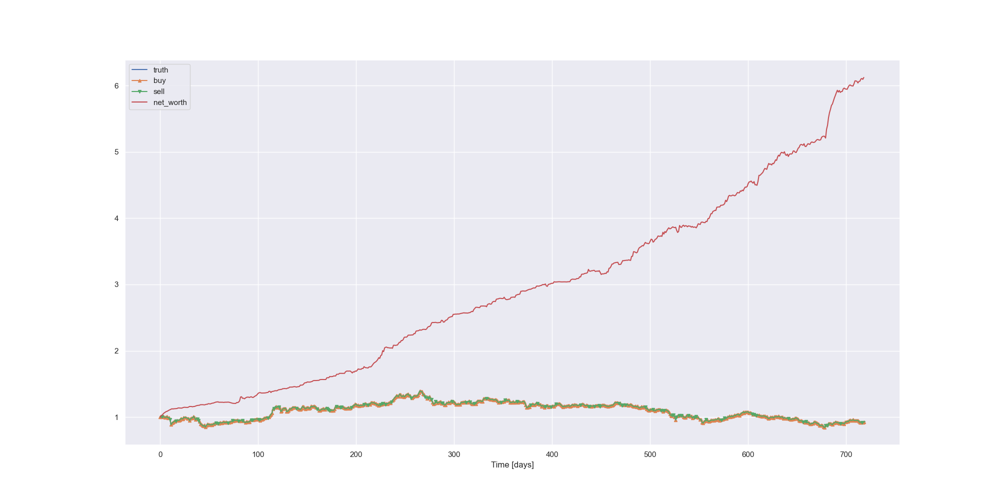

# LosingMoney
A project to losing money by trading stock.

[TOC]

## Feature engineering
In `analysis/corr_check.ipynb`, we process raw data and get total 40 features.

Five basic features are:

| close | open | high | low  | volume/K |
| ----- | ---- | ---- | ---- | -------- |

By those basic features, we can get some simple indicators.

| daliy_region | daily_opengian | daily_gain | ln_Rt |
| ------------ | -------------- | ---------- | ----- |

With economical knowledges, we know there are some classic indicators. They are:

| MACD   | CCI      | MIDPRICE    | SAR      |
| ------ | -------- | ----------- | -------- |
| MACD_l | DX       | HT_DCPERIOD | ADX      |
| MAMA,  | MINUS_DI | HT_DCPHASE  | TRIX     |
| MAMA_l | MINUS_DM | HT_PHASOR   | AROONOSC |
| K      | J        | OBV         | RSI      |
| OC     | CMO      |             |          |

We also refer to ***WorldQuant Formulaic 101 Alphas*** to get some alpha indicators by data mining. 

| alpha_12 | alpha_101 | alpha_54 | alpha_23 |
| -------- | --------- | -------- | -------- |

The heatmap is showed as below.


In current case, we don’t have `nan` data. However, most features don’t follow norm distribution.


One approach to process non-norm data is use `box-cox` transform. We use it and for more “norm” features, which help our predict model. 

We then use Z-score preprocess, which is 
$$
x' = \frac{x - \mu}{\delta}
$$

For features selection, we simply use the **Mutual Information metric**. The results are adjusted latterly by the loss in val set in LSTM model, which is introduced in following.

## LSTM for prediction

 In `model` folder we provided prediction solution with LTSM model.

One noticeable thing is that we change the loss function for better  fitting. Generally, MSE is the loss function for time-series forecasting tasks. But in many specific tasks, predicted time-series data often perform amplitude fluctuations and time delay fluctuations. Those fluctuations often means disasters for stock markets which acquire correct timing and right amplitude predictions.  Simple MSE may hard to guide model to notice this. 

DTW, Soft-DTW, DILATE are loss functions focus on these below mentioned fluctuations, which can better represent the “**diff**” of two time-series. We choose this as a final index. During training, we realize “**percentage**” is the thing we care in stock price predictions. However, simply MAPE can’t help to converge quickly and correctly. Finally we use the weighted sum of MSE and MAPE. The weights is decided by evaluate result on both train and valuate set. We hope the model is leaded by MSE firstly, and gradually care more about MAPE.
$$
Loss: \text{MSE} + 0.3 * \text{MAPE}
$$
We have tried several schedulers. We are encouraged by **fast.ai**‘s concept , we firstly try **`OneCycleLR`** , and result proved it is not the best :cry: .  `ReduceLROnPlateau` is the best.

We finally get MSE of [0.001-0.004] (normalized),MAPE of [0.6%-1.1%] (unnormalized).

```bash
The mean squared error of stock ['close', 'open', 'high', 'low'] is  [0.00333154 0.00114485 0.00204022 0.0019974 ]
The mean squared percentage error of stock close is 0.01032250703054229
The mean squared percentage error of stock open is 0.0060007031343811915
The mean squared percentage error of stock high is 0.008500244227002598
The mean squared percentage error of stock low is 0.008190076182250894
```

## Trading 

We use exisiting Quantitative Trading as baseline. One parameter for this strategy is `setwater`, which represents the aggressive level. 

The strategy can be described as below:

Input: Realtime Price, Predict Max Price, Predict Min Price

Output: The increased money

Parameters: Max money, account position, distribute function, window length

This is the step in one day trading.

1.  For one day, select a Middle Price (open price). Divide several dispersed position from the middle to the predict price.
2.  Calculate the distribute function at every price and normalization it.
3. Set Sell and Sold orders at every price with the distribute function.
4. Reset the account position by buying stocks in the end of day.

This method can proved the rate of success of trading. Also can earn the price difference in one day even if do not sell or buy stocks. This method is popular in China Stock Market now. Most of stocks the seller and the buyer are all the same people since they can use this method to harvest others quickly.

However, considering our model certainly have some errors, we also designed several techniques to acquire best return.

### Distribute Function

The key of this trade method is the distribute function. It is about how many stocks will be sold or bought on each price. $f(x)=x^2$ means we consider our predict is more important. $f(x)=log(x+1)$ means we consider do not lose money is more important. Finally we choose the $f(x) = x + 1.1^{-x}$ which balance the strategy.

### BIAS exists!

As we just mentioned, our strategy feels terrible when predicted high is actually lower than low truth (same as the predicted low). So the set a bias to “adjust” the predicted high and low to have more chances to trade is a natural idea.

When the predict result is not accurate, the trade method will not work. That's why we need bias.

The bias was calculated as max(MAPE)*mean(val of train data), which is finally 50. Therefore, the` high[i] `and` low[i]`change to ` high[i]+10 `and` low[i]-10`.

The return curve is labled 

### I’m OUT

Model do have errors. And it may become continual mistakes. We also want to avoid “unpredictable” period. Therefore, we use rolling  windows to calculate last ***windows*** days return. If that is smaller than 1, it indicates that our trader is losing its money, so the next day it will be out.

### Adaptive WATER

As we mentioned water is a tunable parameter, a natural concept is adjust water during trading.  Every time the trader trades, water will be multiple by  `open[i+1]/open[i]`. After that, water will be set to ensure it is in [0,1].

### Reinforce Learning

For adjusting the water better, we create a Reinforce Learning method to get better water series. We use MLPpolicy and PPO2 optimizer.

#### State

+ past 40 days open,close,high,low and their predict for current day
+ current balance
+ the numbers of held stocks
+ average price for  current buy in stocks (set to 0 when have no held stocks)
+ total sold numbers
+ total sale values

#### Action

action is two-element array,the first element indicators sell or buy or hold, the second express the `amount` to sell or buy.

#### Reward

We set reward as the
$$
0.8*\text{net\_worth}/10^5 + 0.2*\text{last\_net\_worth}/\text{net\_worth} -1
$$
simply express we want more increase on net_worth and less decrease on net_worth.

### Dilution the price

In this problem, the price is set to near 4000. But the real stock should trade at least 100 stock for one time, which is 40,000 yuan for one trade action. It is seriously unreasonable. Therefore, we have another result that adjust the price from near 4000 to near 4 which is dilution the price for 1000 times. Here is the reward about the principle when the price is 4000.


The x-axis is log(10, Principle)

## Results comparing

For the several situations, we prepare four results. For noticeable details, we regard trading fee as **“万1.1”**.

### 1. Baseline with 4000+ price


### 2. Baseline with 1000x dilution


### 3. Reinforce Learning with 4000+ price


### 4. Reinforce Learning with 1000x dilution and quantitative trading



### Summary
For the problem, it shows that reinforce learning method combine with quantitative trading method is better than baseline while the price is 4000+. However, when the stock has 1000x dilution, the origin method is better than reinforce learning since the prediction is quiet accurate. The best result is the baseline with 1000x dilution, which got 560% profit.

## File Structure

```bash
.
├── README.md
├── data
│   ├── ...
├── models
│   ├── config.py
│   ├── data.py # A class to read and preprocess and split the data
│   ├── lstm.py # LSTM model for time series prediction
│   ├── lstm_solution.py # The solution for LSTM model
│   ├── utils.py
├── trading
│   ├── simpleRL # The RL model
│   │   ├── env.py # The environment for RL model
│   │   ├── simpleRL.py # The solution for RL model
│   ├── baseline.ipynb # The baseline solutions
│   ├── wy_baseline.py # Trading tradgeys

```

## Usage

run predict model by

```powershell
python lstm_solution.py
```

run trade baseline in `baseline.ipynb`

run trade RL model by

```
python simpleRL.
```


## Team

| name        | work                                                         |
| ----------- | ------------------------------------------------------------ |
| Xinjie Shen | Features engineering, prediction model, RL model, team leader, report writing, product manager:sunglasses: |
|  Yang Wu    |  Trading algorithm design, report writing, math model design, algorithm test  |
| Guanlin Chen | Report writing, advisor, algorithm test                      |


